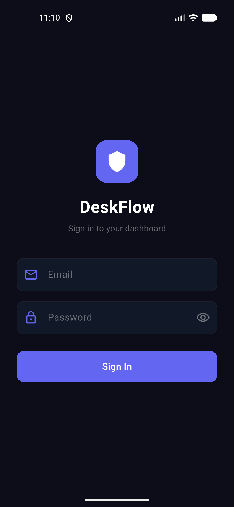
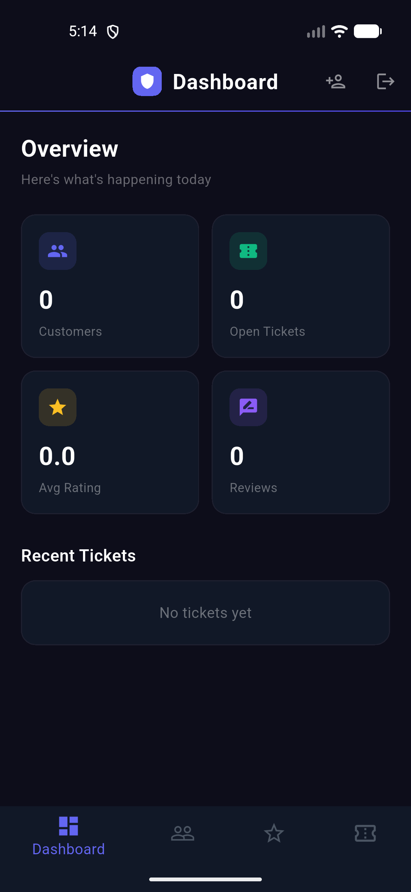
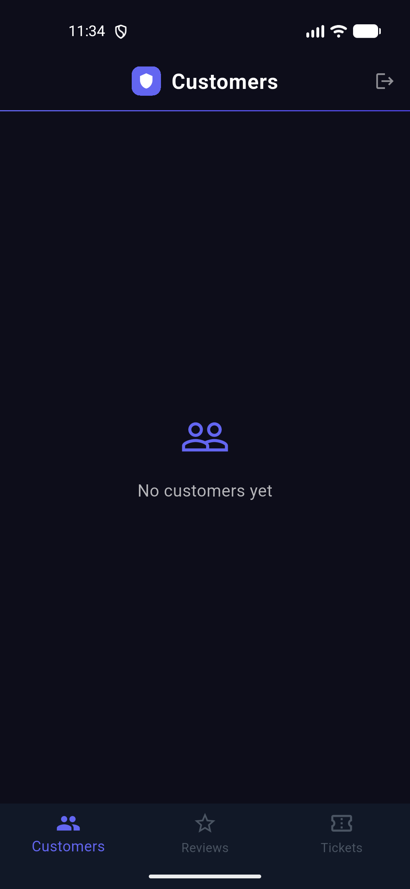
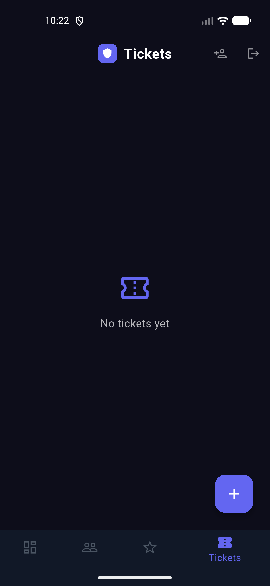
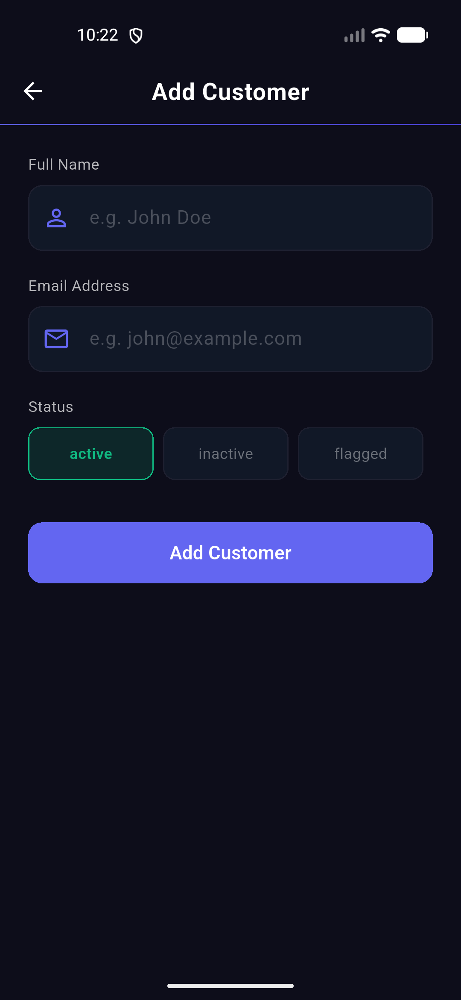

# DeskFlow 🛡️

A secure, full-stack mobile application for managing customer support operations — built with Flutter and Node.js.

---

## 📱 Features

- **Dashboard** — real-time overview of customers, tickets, ratings and activity
- **Customer Management** — add and track customers with status (active, inactive, flagged)
- **Ticket Management** — create and monitor support tickets with open/pending/closed status
- **Review Management** — collect and display customer reviews with star ratings
- **Multi-Admin Support** — primary admin can create accounts for other team members
- **Secure Authentication** — session-based login with 12-hour token expiry and scrypt password hashing

---

## 🛠️ Tech Stack

| Layer | Technology |
|---|---|
| Mobile Frontend | Flutter (Dart) |
| Backend API | Node.js (no frameworks) |
| Database | SQLite |
| Authentication | Session tokens + scrypt hashing |
| Deployment | Railway |
| Version Control | GitHub |

---

## 🚀 Live Backend

The backend is deployed and live at:

https://deskflow-backend-production-8f7e.up.railway.app

---

## 📂 Project Structure
lib/

screens/

login_screen.dart

dashboard_screen.dart

customers_screen.dart

tickets_screen.dart

reviews_screen.dart

admins_screen.dart

add_customer_screen.dart

add_ticket_screen.dart

add_review_screen.dart

services/

api_service.dart

main.dart
---

## 🔐 Security

- Passwords hashed with **scrypt** — industry standard secure hashing
- **Timing-safe comparison** to prevent timing attacks
- All API routes protected — unauthenticated requests return 401
- Sessions expire automatically after 12 hours

---

## 📸 Screenshots

| Login | Dashboard | Customers |
|---|---|---|
|  |  |  |

| Tickets | Reviews | Add Customer |
|---|---|---|
|  |  |  |

---

## 🏃 Running Locally

### Backend
cd deskflow-backend

npm run setup

npm start
### Flutter App
cd deskflow

flutter pub get

flutter run
---

## 👨‍💻 About

Built by **Divine Onyemere** — Criminology graduate pivoting into mobile app development and cybersecurity.

- 🔗 [LinkedIn](https://linkedin.com/in/obinna-onyemere-87413422b)
- 🐙 [GitHub](https://github.com/onyemereobinna9-glitch)

---

## 📌 Roadmap

- [ ] Web version for desktop users
- [ ] Search and filter functionality
- [ ] Push notifications
- [ ] Data export (CSV/PDF)
- [ ] PostgreSQL for production database
- [ ] Google Play Store publication